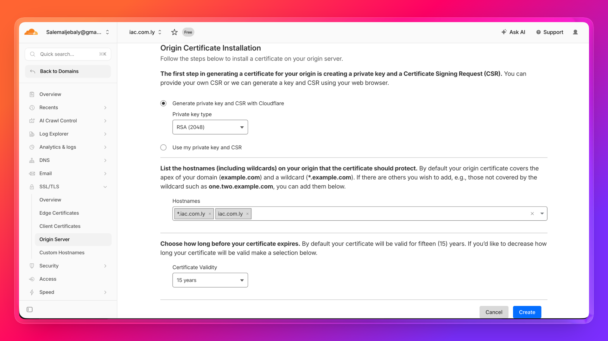
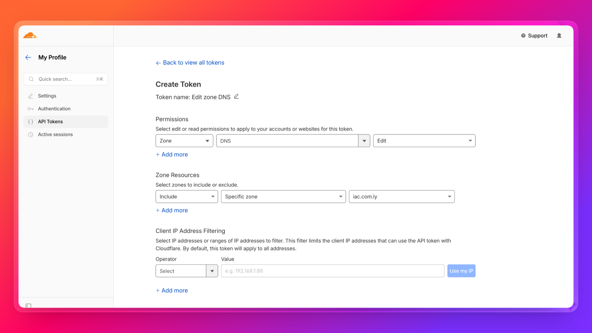
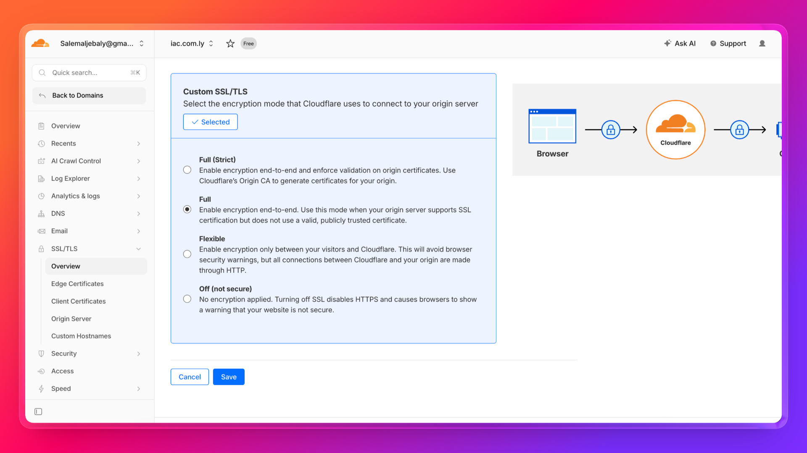

# Hetzner Load Balancer with Cloudflare Origin Certificate (Pulumi + TypeScript)

Self-contained project: 2 app servers behind a public Load Balancer with TLS termination using a Cloudflare Origin Certificate.

- Cloudflare Origin Certificate (15-year validity, issued in the Cloudflare dashboard)
- HTTPS on port 443 — TLS terminated at the Load Balancer
- HTTP on port 80 redirects to HTTPS
- Servers receive plain HTTP on port 80 over the private network — no TLS config needed on the servers
- Cloudflare proxied A record — real Load Balancer IP is hidden, DDoS protection enabled

```
Internet → Cloudflare Edge → HTTPS (443) → Load Balancer (TLS terminated) → HTTP (80) → app-1 or app-2
                             HTTP  (80)  → 301 redirect to HTTPS
```

## Prerequisites

- A domain added to Cloudflare (free plan is sufficient)
- Cloudflare API token with `Zone:DNS:Edit` permission
- Hetzner Cloud API token (Project → Security → API Tokens → Generate)
- [Node.js](https://nodejs.org/) 18+
- [Pulumi CLI](https://www.pulumi.com/docs/install/) installed

## Step 1 — Generate a Cloudflare Origin Certificate

1. Go to [dash.cloudflare.com](https://dash.cloudflare.com) → select your domain
2. Navigate to **SSL/TLS** → **Origin Server** → **Create Certificate**
3. Select **RSA (2048)**, set validity to **15 years**, confirm your hostname
4. Copy the **Certificate** into `cert.pem` and the **Private Key** into `key.pem`



> Keep `key.pem` safe — Cloudflare only shows the private key once.

**Create a Cloudflare API token** with `Zone:DNS:Edit` permission for your domain:



**Set SSL/TLS mode to Full** under SSL/TLS → Overview:



## Setup

```bash
cd hetzner-cloudflare-lb-pulumi
npm install
cp .env.example .env   # fill in all values
set -a && source .env && set +a
pulumi stack init dev
pulumi config set sshPublicKeyPath ~/.ssh/id_rsa.pub
pulumi config set sshAllowedCidrs "[\"$(curl -s ifconfig.me)/32\"]"
pulumi preview
pulumi up
```

## Verify

```bash
curl https://iac.com.ly/
curl https://iac.com.ly/health   # expected: ok
curl -I http://iac.com.ly/       # expected: 301 redirect to HTTPS
```

## Outputs

| Output | Description |
|--------|-------------|
| `loadBalancerPublicIpv4` | Public IP of the load balancer |
| `appUrl` | HTTPS URL to access the app |
| `appHealthUrl` | Health check endpoint |
| `cloudflareNote` | Reminder that traffic is proxied through Cloudflare |
| `server1Name` / `server2Name` | Names of the app servers |
| `server1PrivateIp` / `server2PrivateIp` | Private IPs of the app servers |

## Destroy

```bash
set -a && source .env && set +a
pulumi destroy
pulumi stack rm dev
```

> The Cloudflare DNS record is managed by Pulumi and will be deleted automatically on `pulumi destroy`.
