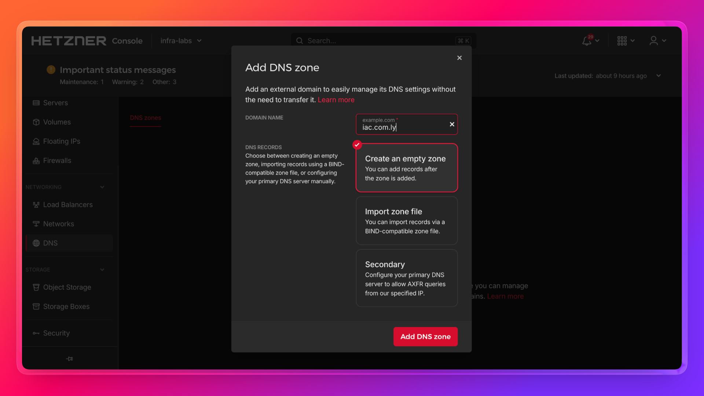
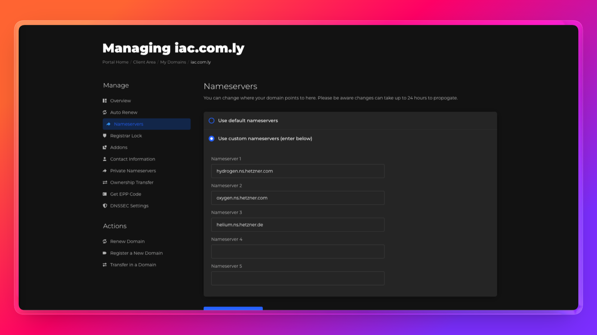
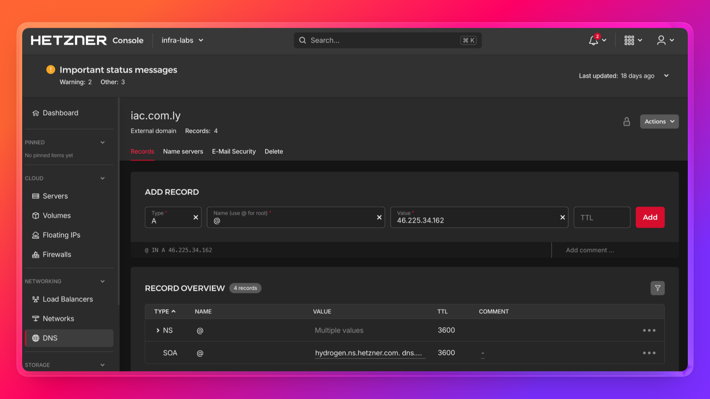

# TLS Termination on Hetzner Load Balancer (Pulumi + TypeScript)

Self-contained project: 2 app servers behind a public Load Balancer with TLS termination using a Hetzner managed certificate.

- Hetzner managed certificate (Let's Encrypt via DNS-01)
- HTTPS on port 443 — TLS terminated at the Load Balancer
- HTTP on port 80 redirects to HTTPS
- Servers receive plain HTTP on port 80 over the private network — no TLS config needed on the servers

```
Internet → HTTPS (443) → Load Balancer (TLS terminated) → HTTP (80) → app-1 or app-2
           HTTP  (80)  → 301 redirect to HTTPS
```

## Prerequisites

- A domain with DNS managed by Hetzner DNS (see DNS setup below)
- Hetzner Cloud API token (Project → Security → API Tokens → Generate)
- [Node.js](https://nodejs.org/) 18+
- [Pulumi CLI](https://www.pulumi.com/docs/install/) installed

## DNS Setup

Hetzner managed certificates require Hetzner DNS to be authoritative for your domain.

**1. Create a zone in Hetzner DNS**

Go to [dns.hetzner.com](https://dns.hetzner.com) → Add zone → enter your root domain (e.g. `iac.com.ly`).



**2. Update nameservers at your registrar**

Point your domain to Hetzner's nameservers:

```
hydrogen.ns.hetzner.com
oxygen.ns.hetzner.com
helium.ns.hetzner.de
```



**3. Verify propagation**

```bash
dig NS iac.com.ly +short
```

Should return Hetzner's nameservers. Takes up to 10 minutes.

**4. Add A record after deploy**

After `pulumi up`, add an A record in Hetzner DNS pointing your domain to the Load Balancer IP:



```bash
pulumi stack output dnsNote
```

## Setup

```bash
cd hetzner-tls-lb-pulumi
npm install
cp .env.example .env   # fill in HCLOUD_TOKEN and PULUMI_CONFIG_PASSPHRASE
```

```bash
set -a && source .env && set +a
pulumi config set domain iac.com.ly
pulumi config set sshPublicKeyPath ~/.ssh/id_rsa.pub
pulumi config set --secret hcloudToken "$HCLOUD_TOKEN"
pulumi config set sshAllowedCidrs "[\"$(curl -s ifconfig.me)/32\"]"
```

```bash
pulumi preview
pulumi up
```

## Verify

```bash
curl https://iac.com.ly/
curl https://iac.com.ly/health   # expected: ok
curl -I http://iac.com.ly/       # expected: 301 redirect to HTTPS
```

## Outputs

| Output | Description |
|--------|-------------|
| `loadBalancerPublicIpv4` | Public IP of the load balancer |
| `dnsNote` | Reminder with the exact A record to add in Hetzner DNS |
| `cleanupNote` | Reminder to delete the DNS A record before destroying |
| `appUrl` | HTTPS URL to access the app |
| `appHealthUrl` | Health check endpoint |
| `server1Name` / `server2Name` | Names of the app servers |
| `server1PrivateIp` / `server2PrivateIp` | Private IPs of the app servers |

## Destroy

Delete the DNS A record in Hetzner DNS first, then:

```bash
set -a && source .env && set +a
pulumi destroy
pulumi stack rm dev
```
